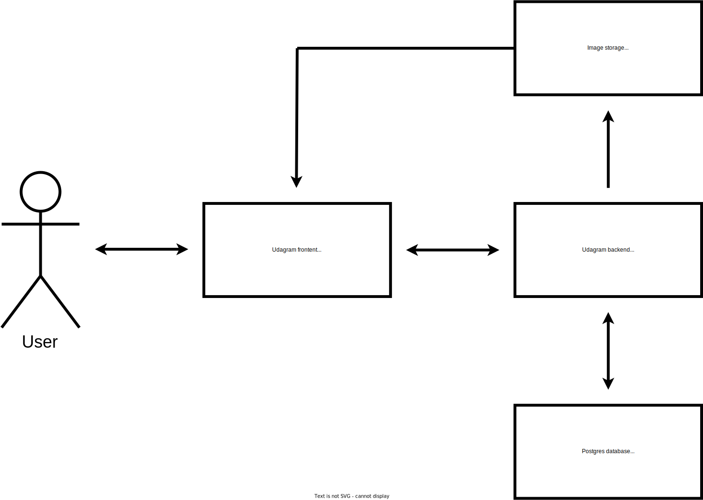

# Infrastructure

## Dependencies
- AWS RDS
- AWS Elastic Beanstalk (EB)
- AWS S3

## Description
- The user connects to the frontend in an S3 bucket (frontend).
- The frontend sends get requests to the backend on EB in order to fetch existing posts.
- The frontend sends post requests to the backend on EB in order register or login the user and to add posts.
- The backend stores data to and retrieves data from a postgres RDS.
- The backend stores images in an S3 bucket (images).
- The backend sends data to the frontend.
- The S3 bucket (frontend) fetches images from the S3 bucket (images) based in the URL inside the data that was sent by the backend.

## Diagram

