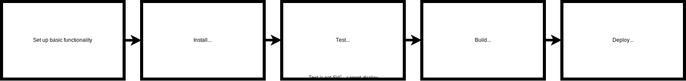

# Pipeline

## Dependencies
- github repository
- CircleCI with access to the repository

## Description
The pipeline involves one job and one workflow - I know this needs to be made
more granular in larger projects. It's defined in the [configuration file](/.circleci/config.yml)
of CircleCI. It uses a docker image with Node.js v16, because the default stable
image seems to be shipping with v17 which caused trouble with some library that
required OpenSSL settings.

## Steps started on each push to the repository
- Set up basic functionality
  - Install Node.js
  - Checkout code
  - Install Google Chrome (for frontend test)
  - Install AWS CLI
  - Configure AWS
  - Set up Elastic Beanstalk
- Install backend
- Install frontend
- Test backend
- Test frontend
- Build backend
- Build frontend
- Deploy backend (in Elastic Beanstalk environment)
- Deploy frontend (in S3 bucket)

## Diagram

